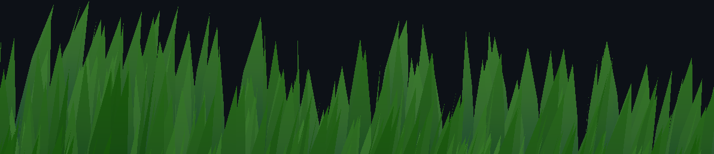
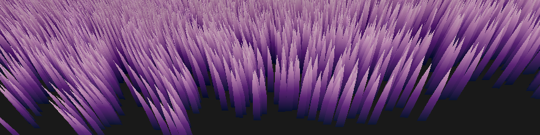
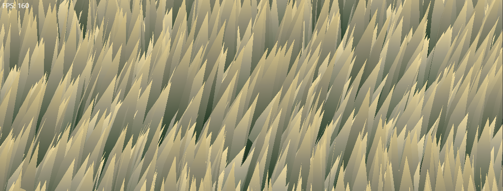

# WebGPU Grass

A study on how modern games render large amounts of grass -
I made this project to get into graphics programming and writing shaders, through WebGPU, the successor to WebGL. Study guided by [Acerola](https://www.youtube.com/@Acerola_t)!

### Built with

- WebGPU, WGSL
- [wgpu-matrix](https://wgpu-matrix.org/)
- [WGSL Noise Algorithms](https://gist.github.com/munrocket/236ed5ba7e409b8bdf1ff6eca5dcdc39)
- [tweakpane](https://cocopon.github.io/tweakpane/)

### Links

- Check it out [here!](https://arnh8.github.io/webgpu-grass)

#

4,194,304 blades of grass rendered at 160fps, 2000x1200 resolution (on an RTX 3080)

